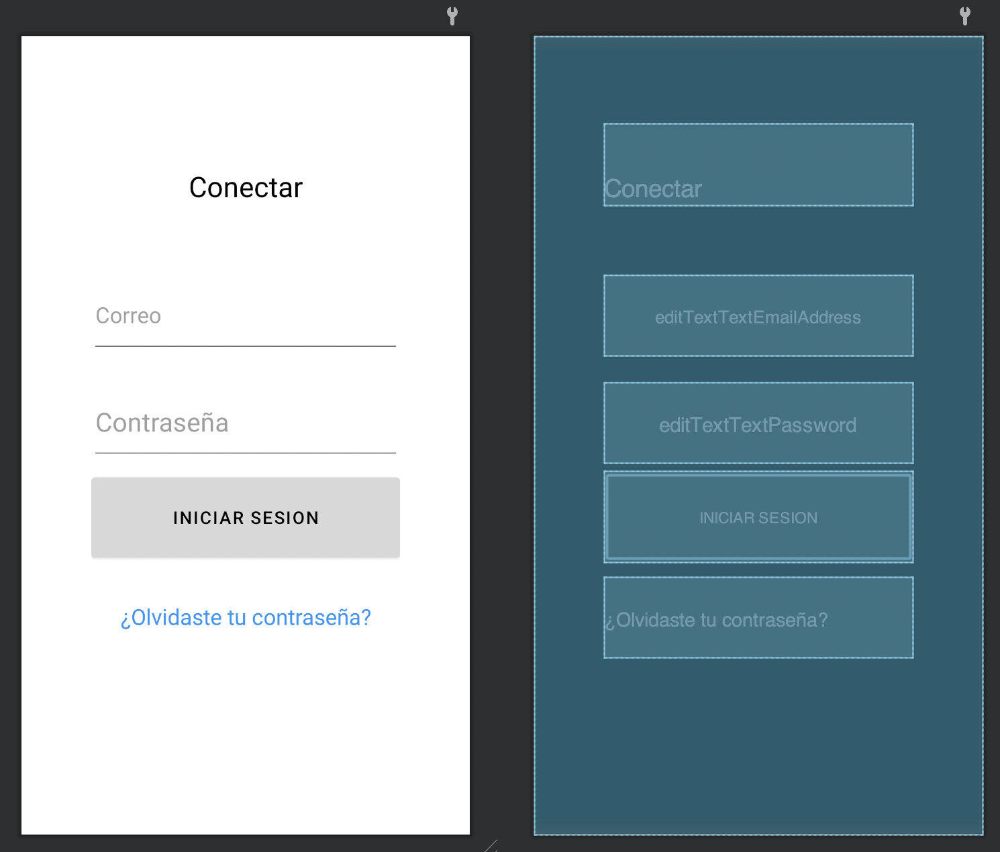
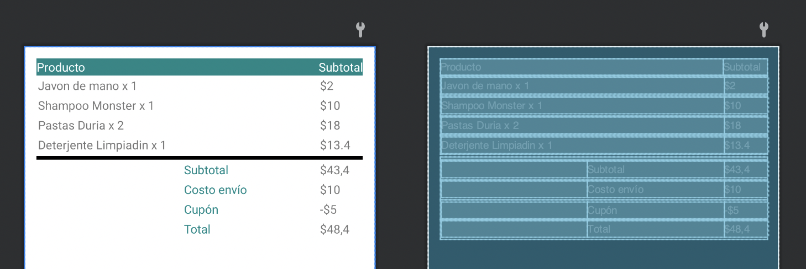
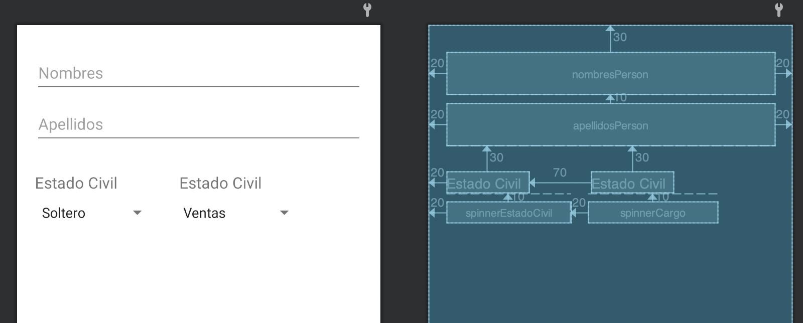
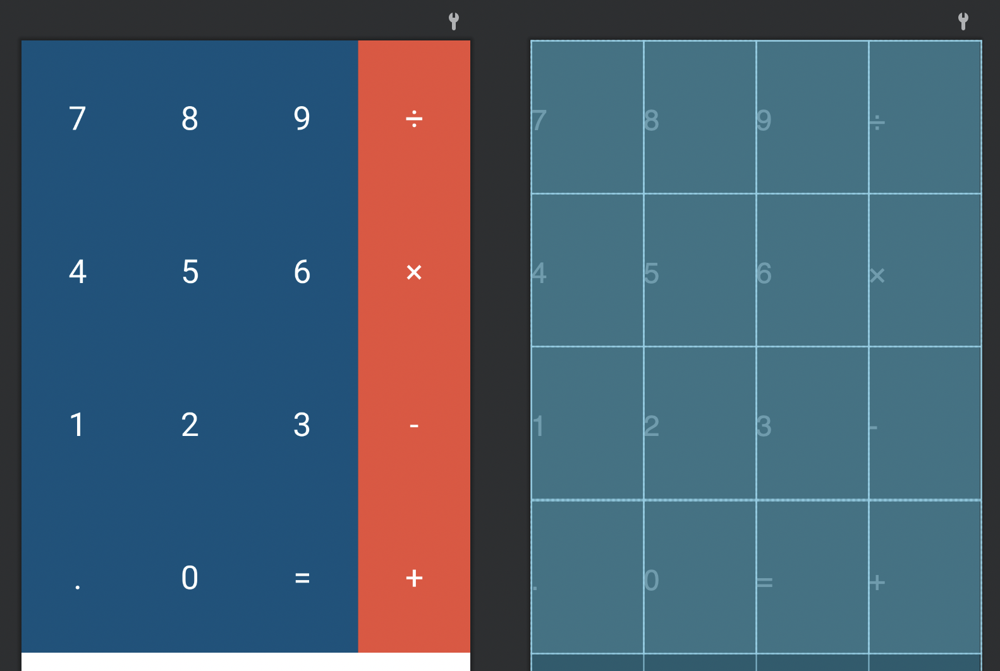

# Ejercicio 7 - Layouts 02

## Introducción

- Grupo: GRUPO 09
    - Integrantes:
        - RODRIGO SÁNCHEZ GÓMEZ
        - DANIEL IZQUIERDO BONILLA

Dadas las pautas a seguir para la realización de este ejercicio, acometemos los ejemplos descritos en su formato indicado.

## Ejercicios

### Utilizando LinearLayout, crea un diseño similar a un diseño de login, donde se muestren campos para digitar el usuario y el password

- Elementos a incorporar:
    - TextView inicial indicando la actividad a realizar.
    - Campo de introducción de texto "Correo".
    - Campo de introducción de texto "Contraseña".
    - Botón "INICIAR SESION" con su respectivo diseño.
    - TextView indicando "¿Olvidaste tu contraseña?

El resultante del Layout en base a los criterios especificados es el siguiente:



El código del Layout propuesto y ejecutado para este ejercicio se muestra a continuación:

```xml
<LinearLayout xmlns:android="http://schemas.android.com/apk/res/android"
    android:layout_width="match_parent"
    android:layout_height="fill_parent"
    android:orientation="vertical"
    android:padding="64dp">

    <TextView
        android:id="@+id/textView"
        android:layout_width="match_parent"
        android:layout_height="wrap_content"
        android:layout_marginTop="16dp"
        android:gravity="center"
        android:paddingTop="40dp"
        android:textSize="26sp"
        android:textColor="@color/black"
        android:text="@string/conectar" />

    <EditText
        android:id="@+id/editTextTextEmailAddress"
        android:layout_width="match_parent"
        android:layout_height="74dp"
        android:layout_marginTop="64dp"
        android:ems="10"
        android:hint="@string/correo"
        android:textSize="20sp"
        android:inputType="textEmailAddress" />

    <EditText
        android:id="@+id/editTextTextPassword"
        android:layout_width="match_parent"
        android:layout_height="74dp"
        android:layout_marginTop="24dp"
        android:ems="10"
        android:hint="@string/contrase_a"
        android:textSize="24sp"
        android:inputType="textPassword" />

    <Button
        android:id="@+id/button"
        android:layout_width="match_parent"
        android:layout_height="84dp"
        android:backgroundTint="#D8D8D8"
        android:textSize="16sp"
        android:textColor="@color/black"
        android:layout_marginTop="8dp"
        android:text="@string/iniciar_sesion" />

    <TextView
        android:id="@+id/textView2"
        android:layout_width="match_parent"
        android:layout_height="74dp"
        android:layout_marginTop="12dp"
        android:clickable="true"
        android:gravity="center"
        android:text="@string/olvidaste_tu_contrase_a"
        android:textColor="#2196F3"
        android:textSize="20sp" />

</LinearLayout>
```

- Elementos a destacar:
    - Al primer TextView le aplicamos un marginTop de 16dp para dejar un poco de espacio entre el elemento en sí y el texto a visualizar. De esta forma, conseguimos lo que se propone en la captura provista en el enunciado.
    - El hint de "Contraseña" es más grande. Para ello, establecemos un textSize proporcional al del enunciado y establecemos la propiedad ```android:ems``` a 10 para cuadrarlo y establecer una relación proporcional de tamaño con las otras vistas.
    - Para el botón, aplicamos un layout_height de 84dp para hacerlo más grande conforme al ejemplo mostrado en el enunciado, y como de por sí está centrado, no hace falta establecer propiedades gravity.
    - El TextView de "¿Olvidaste tu contraseña?" no tiene mucho misterio, pues lo único que se modifica es el tamaño, el color, se define que se puede hacer clic con la propiedad ```android:clickable``` y cambiamos su color a azul. Centramos con un gravity y ¡listo!

### Utilizando TableLayout, crea un diseño similar a una factura en forma de tabla

- Elementos a incorporar:
    - Columna para productos
    - Columna para subtotal
    - Línea divisora al final de estas columnas
    - Subtotal con su correspondiente cálculo económico

El resultante del Layout en base a los criterios especificados es el siguiente:



El código del Layout propuesto y ejecutado para este ejercicio se muestra a continuación:

```xml
<TableLayout xmlns:android="http://schemas.android.com/apk/res/android"
    android:layout_width="match_parent"
    android:layout_height="match_parent"
    android:padding="14dp"
    android:stretchColumns="0,1,2">

    <TableRow
        android:layout_width="wrap_content"
        android:layout_height="match_parent"
        android:background="@color/teal_700"
        android:padding="0.5dp">

        <TextView
            android:id="@+id/estadoCivilText"
            android:layout_width="wrap_content"
            android:layout_height="wrap_content"
            android:layout_span="3"
            android:text="@string/producto"
            android:textColor="@color/white" />

        <TextView
            android:id="@+id/textView4"
            android:layout_width="wrap_content"
            android:layout_height="wrap_content"
            android:text="@string/subtotal"
            android:textColor="@color/white" />

    </TableRow>

    <TableRow
        android:layout_width="match_parent"
        android:layout_height="match_parent"
        android:padding="2dp">

        <TextView
            android:id="@+id/textView5"
            android:layout_width="wrap_content"
            android:layout_height="wrap_content"
            android:layout_span="3"
            android:text="@string/javon_de_mano_x_1" />

        <TextView
            android:id="@+id/textView6"
            android:layout_width="wrap_content"
            android:layout_height="wrap_content"
            android:text="@string/_2" />

    </TableRow>

    <TableRow
        android:layout_width="match_parent"
        android:layout_height="match_parent"
        android:padding="2dp">

        <TextView
            android:id="@+id/textView7"
            android:layout_width="wrap_content"
            android:layout_height="wrap_content"
            android:layout_span="3"
            android:text="@string/shampoo_monster_x_1" />

        <TextView
            android:id="@+id/textView8"
            android:layout_width="wrap_content"
            android:layout_height="wrap_content"
            android:text="@string/_10" />

    </TableRow>

    <TableRow
        android:layout_width="match_parent"
        android:layout_height="match_parent"
        android:padding="2dp">

        <TextView
            android:id="@+id/textView9"
            android:layout_width="wrap_content"
            android:layout_height="wrap_content"
            android:layout_span="3"
            android:text="@string/pastas_duria_x_2" />

        <TextView
            android:id="@+id/textView10"
            android:layout_width="wrap_content"
            android:layout_height="wrap_content"
            android:text="@string/_18" />

    </TableRow>

    <TableRow
        android:layout_width="match_parent"
        android:layout_height="match_parent"
        android:padding="2dp">

        <TextView
            android:id="@+id/textView11"
            android:layout_width="wrap_content"
            android:layout_height="wrap_content"
            android:layout_span="3"
            android:text="@string/deterjente_limpiadin_x_1" />

        <TextView
            android:id="@+id/textView12"
            android:layout_width="wrap_content"
            android:layout_height="wrap_content"
            android:text="@string/_13_4" />

    </TableRow>

    <!-- Borde -->
    <TableRow
        android:layout_height="1px"
        android:layout_marginTop="2dp"
        android:background="#BDBDBD">

        <TextView
            android:layout_width="fill_parent"
            android:layout_height="4dp"
            android:background="@color/black"
            android:layout_span="4"
            android:text="" />
    </TableRow>

    <TableRow
        android:layout_width="match_parent"
        android:layout_height="match_parent"
        android:padding="2dp">

        <TextView
            android:id="@+id/textView3"
            android:layout_width="wrap_content"
            android:layout_height="wrap_content"
            android:layout_span="2"
            android:text="" />

        <TextView
            android:id="@+id/textView13"
            android:layout_width="wrap_content"
            android:layout_height="wrap_content"
            android:textColor="@color/teal_700"
            android:text="@string/subtotal" />

        <TextView
            android:id="@+id/textView14"
            android:layout_width="wrap_content"
            android:layout_height="wrap_content"
            android:text="@string/_43_4" />

    </TableRow>

    <TableRow
        android:layout_width="match_parent"
        android:layout_height="match_parent"
        android:padding="2dp">

        <TextView
            android:id="@+id/textView15"
            android:layout_width="wrap_content"
            android:layout_height="wrap_content"
            android:layout_span="2"
            android:text="" />

        <TextView
            android:id="@+id/textView16"
            android:layout_width="wrap_content"
            android:layout_height="wrap_content"
            android:textColor="@color/teal_700"
            android:text="@string/costo_env_o" />

        <TextView
            android:id="@+id/textView17"
            android:layout_width="wrap_content"
            android:layout_height="wrap_content"
            android:text="@string/_10" />

    </TableRow>

    <TableRow
        android:layout_width="match_parent"
        android:layout_height="match_parent"
        android:padding="2dp">

        <TextView
            android:id="@+id/textView18"
            android:layout_width="wrap_content"
            android:layout_height="wrap_content"
            android:layout_span="2"
            android:text="" />

        <TextView
            android:id="@+id/textView19"
            android:layout_width="wrap_content"
            android:layout_height="wrap_content"
            android:textColor="@color/teal_700"
            android:text="@string/cup_n" />

        <TextView
            android:id="@+id/textView20"
            android:layout_width="wrap_content"
            android:layout_height="wrap_content"
            android:text="@string/_5" />

    </TableRow>

    <TableRow
        android:layout_width="match_parent"
        android:layout_height="match_parent"
        android:padding="2dp">

        <TextView
            android:id="@+id/textView21"
            android:layout_width="wrap_content"
            android:layout_height="wrap_content"
            android:layout_span="2"
            android:text="" />

        <TextView
            android:id="@+id/textView22"
            android:layout_width="wrap_content"
            android:layout_height="wrap_content"
            android:textColor="@color/teal_700"
            android:text="@string/total" />

        <TextView
            android:id="@+id/textView23"
            android:layout_width="wrap_content"
            android:layout_height="wrap_content"
            android:text="@string/_48_4" />

    </TableRow>

</TableLayout>
```

- Elementos a destacar:
    - Codificado en forma de tabla, empleamos distintas filas para la realización de este ejercicio, aplicando el stretchColumns a "0,1,2".
    - Con la propiedad background aplicado al primer y segundo TableRow, cambiamos el color del fondo tal y como se muestra en la captura.
    - El espacio dejado entre los TextView de Subtotal, Costo envío, etc son TextView en blanco, que junto con la propiedad layout_span, hacen que deje el espacio perfecto para su alineación a la derecha.
    - Todos los colores empleados en la captura de ejemplo del enunciado han sido utilizados en la realización de este ejercicio tal y como se muestra en la imagen adjuntada.

### Utilizando RelativeLayout, crea un diseño de un pequeño formulario con cuatro campos de una persona

- Elementos a incorporar:
    - EditText para el nombre y apellidos
    - TextView de categorías (tanto estado civil como cargo)
    - Spinner (refernetes a los TextView anteriores)

El resultante del Layout en base a los criterios especificados es el siguiente:



El código del Layout propuesto y ejecutado para este ejercicio se muestra a continuación:

```xml
<?xml version="1.0" encoding="utf-8"?>
<RelativeLayout xmlns:android="http://schemas.android.com/apk/res/android"
    xmlns:tools="http://schemas.android.com/tools"
    android:layout_width="match_parent"
    android:layout_height="match_parent"
    tools:context=".Ejercicio3">

    <EditText
        android:id="@+id/nombresPerson"
        android:layout_width="match_parent"
        android:layout_height="wrap_content"
        android:layout_alignParentStart="true"
        android:layout_alignParentTop="true"
        android:layout_alignParentEnd="true"
        android:layout_marginStart="20dp"
        android:layout_marginTop="30dp"
        android:layout_marginEnd="20dp"
        android:ems="10"
        android:hint="Nombres"
        android:inputType="textPersonName"
        android:minHeight="48dp" />

    <EditText
        android:id="@+id/apellidosPerson"
        android:layout_width="match_parent"
        android:layout_height="wrap_content"
        android:layout_below="@+id/nombresPerson"
        android:layout_alignParentStart="true"
        android:layout_alignParentEnd="true"
        android:layout_marginStart="20dp"
        android:layout_marginTop="10dp"
        android:layout_marginEnd="20dp"
        android:ems="10"
        android:hint="Apellidos"
        android:inputType="textPersonName"
        android:minHeight="48dp" />

    <TextView
        android:id="@+id/estadoCivilText"
        android:layout_width="wrap_content"
        android:layout_height="wrap_content"
        android:layout_below="@+id/apellidosPerson"
        android:layout_alignParentStart="true"
        android:layout_marginStart="20dp"
        android:layout_marginTop="30dp"
        android:text="Estado Civil"
        android:textSize="18sp" />

    <Spinner
        android:id="@+id/spinnerEstadoCivil"
        android:layout_width="wrap_content"
        android:layout_height="wrap_content"
        android:layout_below="@+id/estadoCivilText"
        android:layout_alignParentStart="true"
        android:layout_marginStart="20dp"
        android:layout_marginTop="10dp"
        android:entries="@array/estado_civiles"
        tools:ignore="TouchTargetSizeCheck" />

    <TextView
        android:id="@+id/cargosText"
        android:layout_width="wrap_content"
        android:layout_height="wrap_content"
        android:layout_below="@+id/apellidosPerson"
        android:layout_marginStart="70dp"
        android:layout_marginTop="30dp"
        android:layout_toEndOf="@+id/estadoCivilText"
        android:text="Cargo"
        android:textSize="18sp" />

    <Spinner
        android:id="@+id/spinnerCargo"
        android:layout_width="wrap_content"
        android:layout_height="wrap_content"
        android:layout_below="@+id/cargosText"
        android:layout_marginStart="20dp"
        android:layout_marginTop="10dp"
        android:layout_toEndOf="@+id/spinnerEstadoCivil"
        android:entries="@array/cargos"
        tools:ignore="TouchTargetSizeCheck" />

</RelativeLayout>
```

- Elementos a destacar:
    - Todas las vistas están relacionadas entre sí; es decir, están bajo Constraints, aunque no exactamente. Las vistas están relacionadas y establecidas mediante un número determinado de marginTop, marginStart o marginEnd.
    - Los Spinners están establecidos mediante su vista en XML, pero, ¿cómo están definidos? Es más simple de lo que nosotros pensamos en un principio. Seguimos estos pasos:
        - Establecemos los String (es decir, el texto que aparecerá en cada una de las opciones) en el archivo ```strings.xml``` ubicado en /res/values/strings.xml. Los creamos definiendo un string-array. Añadimos los items y ¡listo!
        - Ahora, establecemos la propiedad ```android:entries"``` a la ruta del objeto que acabamos de crear. En su correspondiente tendrá un ID distinto.
    - Y... ¡listo!

### Utilizando GridLayout, crea un diseño del teclado de una calculadora simple

- Elementos a incorporar:
    - Dos tipos de botones:
         - 3 azules por cada fila (numéricos) y 1 rojo (símbolo que equivaldrá a una operación arimética)

El resultante del Layout en base a los criterios especificados es el siguiente:



El código del Layout propuesto y ejecutado para este ejercicio se muestra a continuación:

```xml
<?xml version="1.0" encoding="utf-8"?>
<GridLayout xmlns:android="http://schemas.android.com/apk/res/android"
    android:layout_width="match_parent"
    android:layout_height="match_parent"
    android:columnCount="4"
    android:orientation="horizontal"
    android:rowCount="1">


    <androidx.appcompat.widget.AppCompatButton
        android:id="@+id/textView18"
        style="@style/AppTheme.BotonCalculadora.Azul"
        android:layout_width="34dp"
        android:layout_height="140dp"
        android:layout_columnWeight="1"
        android:gravity="center"
        android:text="7"
        android:textColor="@color/white"
        android:textSize="30sp" />

    <androidx.appcompat.widget.AppCompatButton
        android:id="@+id/textView19"
        style="@style/AppTheme.BotonCalculadora.Azul"
        android:layout_width="34dp"
        android:layout_height="140dp"
        android:layout_columnWeight="1"
        android:gravity="center"
        android:text="8"
        android:textColor="@color/white"
        android:textSize="30sp" />

    <androidx.appcompat.widget.AppCompatButton
        android:id="@+id/textView20"
        style="@style/AppTheme.BotonCalculadora.Azul"
        android:layout_width="34dp"
        android:layout_height="140dp"
        android:layout_columnWeight="1"
        android:gravity="center"
        android:text="9"
        android:textColor="@color/white"
        android:textSize="30sp" />

    <androidx.appcompat.widget.AppCompatButton
        android:id="@+id/textView21"
        style="@style/AppTheme.BotonCalculadora.Rojo"
        android:layout_width="34dp"
        android:layout_height="140dp"
        android:layout_columnWeight="1"
        android:gravity="center"
        android:text="÷"
        android:textColor="@color/white"
        android:textSize="30sp" />

    <androidx.appcompat.widget.AppCompatButton
        android:id="@+id/textView22"
        style="@style/AppTheme.BotonCalculadora.Azul"
        android:layout_width="34dp"
        android:layout_height="140dp"
        android:layout_columnWeight="1"
        android:gravity="center"
        android:text="4"
        android:textColor="@color/white"
        android:textSize="30sp" />

    <androidx.appcompat.widget.AppCompatButton
        android:id="@+id/textView23"
        style="@style/AppTheme.BotonCalculadora.Azul"
        android:layout_width="34dp"
        android:layout_height="140dp"
        android:layout_columnWeight="1"
        android:gravity="center"
        android:text="5"
        android:textColor="@color/white"
        android:textSize="30sp" />

    <androidx.appcompat.widget.AppCompatButton
        android:id="@+id/textView24"
        style="@style/AppTheme.BotonCalculadora.Azul"
        android:layout_width="34dp"
        android:layout_height="140dp"
        android:layout_columnWeight="1"
        android:gravity="center"
        android:text="6"
        android:textColor="@color/white"
        android:textSize="30sp" />

    <androidx.appcompat.widget.AppCompatButton
        android:id="@+id/textView25"
        style="@style/AppTheme.BotonCalculadora.Rojo"
        android:layout_width="34dp"
        android:layout_height="140dp"
        android:layout_columnWeight="1"
        android:gravity="center"
        android:text="×"
        android:textColor="@color/white"
        android:textSize="30sp" />

    <androidx.appcompat.widget.AppCompatButton
        android:id="@+id/textView26"
        style="@style/AppTheme.BotonCalculadora.Azul"
        android:layout_width="34dp"
        android:layout_height="140dp"
        android:layout_columnWeight="1"
        android:gravity="center"
        android:text="1"
        android:textColor="@color/white"
        android:textSize="30sp" />

    <androidx.appcompat.widget.AppCompatButton
        android:id="@+id/textView27"
        style="@style/AppTheme.BotonCalculadora.Azul"
        android:layout_width="34dp"
        android:layout_height="140dp"
        android:layout_columnWeight="1"
        android:gravity="center"
        android:text="2"
        android:textColor="@color/white"
        android:textSize="30sp" />

    <androidx.appcompat.widget.AppCompatButton
        android:id="@+id/textView28"
        style="@style/AppTheme.BotonCalculadora.Azul"
        android:layout_width="34dp"
        android:layout_height="140dp"
        android:layout_columnWeight="1"
        android:gravity="center"
        android:text="3"
        android:textColor="@color/white"
        android:textSize="30sp" />

    <androidx.appcompat.widget.AppCompatButton
        android:id="@+id/textView29"
        style="@style/AppTheme.BotonCalculadora.Rojo"
        android:layout_width="34dp"
        android:layout_height="140dp"
        android:layout_columnWeight="1"
        android:gravity="center"
        android:text="-"
        android:textColor="@color/white"
        android:textSize="30sp" />

    <androidx.appcompat.widget.AppCompatButton
        android:id="@+id/textView30"
        style="@style/AppTheme.BotonCalculadora.Azul"
        android:layout_width="34dp"
        android:layout_height="140dp"
        android:layout_columnWeight="1"
        android:gravity="center"
        android:text="."
        android:textColor="@color/white"
        android:textSize="30sp" />

    <androidx.appcompat.widget.AppCompatButton
        android:id="@+id/textView31"
        style="@style/AppTheme.BotonCalculadora.Azul"
        android:layout_width="34dp"
        android:layout_height="140dp"
        android:layout_columnWeight="1"
        android:gravity="center"
        android:text="0"
        android:textColor="@color/white"
        android:textSize="30sp" />

    <androidx.appcompat.widget.AppCompatButton
        android:id="@+id/textView32"
        style="@style/AppTheme.BotonCalculadora.Azul"
        android:layout_width="34dp"
        android:layout_height="140dp"
        android:layout_columnWeight="1"
        android:gravity="center"
        android:text="="
        android:textColor="@color/white"
        android:textSize="30sp" />

    <androidx.appcompat.widget.AppCompatButton
        android:id="@+id/textView33"
        style="@style/AppTheme.BotonCalculadora.Rojo"
        android:layout_width="34dp"
        android:layout_height="140dp"
        android:layout_columnWeight="1"
        android:gravity="center"
        android:text="+"
        android:textColor="@color/white"
        android:textSize="30sp" />
</GridLayout>
```

- Elementos a destacar:
    - Establecemos la propiedad ```android:columnCount```en 4 para indicar que por cada fila vamos a tener 4 elementos/vistas.
    - Establecemos las propiedades de padding correspondientes para hacer que se vean lo más parecidas a la captura provista en el enunciado.
    - Establecemos la gravity a "center" para centrar los dígitos/símbolos matemáticos y modificamos el background (color de fondo) y el textColor (color del texto en sí) para igualarlos lo máximo al enunciado.

¡Fin de la práctica!

- Repositorio: YOUR_REPO_HERE